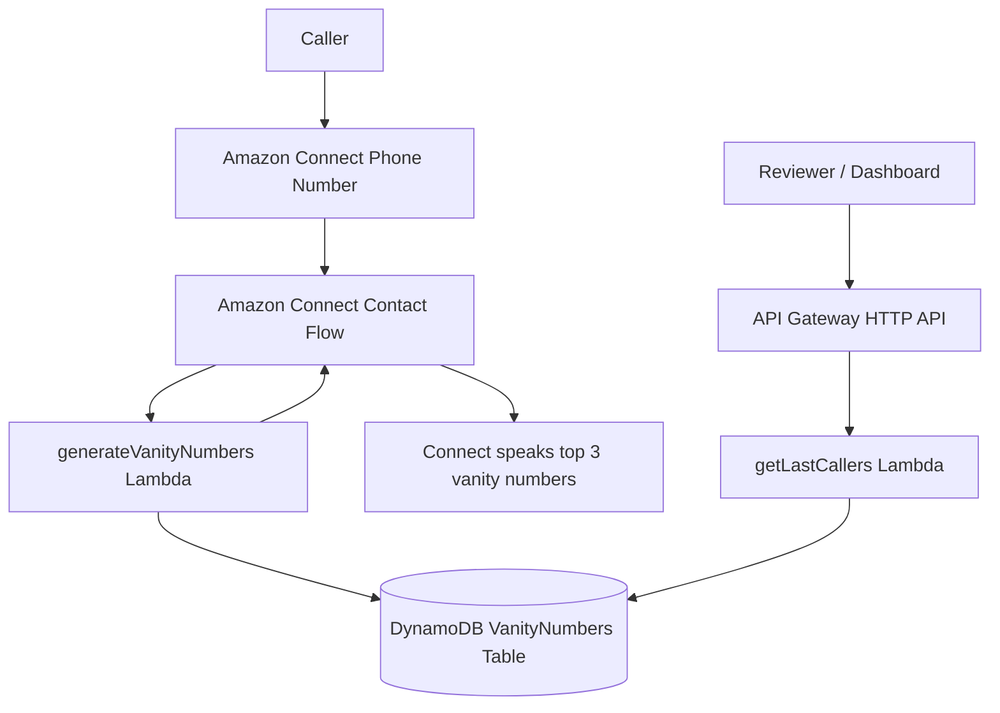

# Vanity Number App

Production-oriented AWS serverless implementation for the Amazon Connect vanity number assignment.

The application receives a caller phone number from Amazon Connect, generates ranked vanity number candidates, stores the best results in DynamoDB with only a masked caller number, and exposes the latest caller records through an HTTP API for a dashboard or reviewer-facing client.

## Implemented Scope

- `generateVanityNumbers` Lambda for Amazon Connect.
- `getLastCallers` Lambda behind API Gateway HTTP API.
- Cognito/JWT authentication for the dashboard API.
- DynamoDB persistence with masked caller data and GSI-backed latest-caller reads.
- TypeScript domain logic for phone normalization, keypad conversion, candidate scoring, and PII masking.
- AWS SAM infrastructure as code.
- Unit and handler tests with Jest.
- Deployment and manual testing documentation.
- React/Vite dashboard for recent caller records.
- S3 + CloudFront hosting for the dashboard frontend.
- GitHub Actions CI and manual SAM deployment workflow.
- Optional Amazon Connect contact flow deployment artifacts.
- Live Amazon Connect validation path with a claimed phone number.

## Architecture



## Application Flow

1. Amazon Connect invokes `generateVanityNumbers`.
2. The Lambda extracts `Details.ContactData.CustomerEndpoint.Address`.
3. The phone number is normalized and validated.
4. The last seven digits are converted into vanity candidates.
5. Candidates are scored deterministically.
6. The top five vanity numbers and masked caller number are stored in DynamoDB with a `ContactId`-based idempotency key when available.
7. The top three are returned to Amazon Connect as string attributes.
8. `GET /callers/latest` returns the latest caller records for a dashboard with masked caller numbers.

## Vanity Algorithm

Telephone keypad mapping:

```txt
2 = ABC
3 = DEF
4 = GHI
5 = JKL
6 = MNO
7 = PQRS
8 = TUV
9 = WXYZ
0 = 0
1 = 1
```

The algorithm focuses on the last seven digits of the phone number because those are typically the most memorable portion. It checks a local common-word list first, then looks for embedded words that can produce hybrid candidates such as `CALL123`, and finally generates a capped deterministic candidate set to avoid unbounded combinatorial work.

Candidates score higher when they:

- match a known local word, such as `FLOWERS`;
- contain a known partial word, such as `CALL`;
- contain a balanced number of vowels;
- avoid long repeated letter runs;
- look more pronounceable through shorter consonant runs and more vowel/consonant transitions;
- convert the complete seven-digit vanity segment;
- retain digits only when that helps preserve a recognizable word;
- avoid rare letters unless needed.

The algorithm does not call external services, which keeps the Lambda deterministic, inexpensive, and reliable.

Example:

```txt
Input:  +18003569377
Output: +1-800-FLOWERS
```

## Repository Structure

```txt
backend/
  src/
    config/            Shared constants and environment configuration
    data/              Local word list used by the scoring algorithm
    handlers/          Lambda handlers
    repositories/      DynamoDB access layer
    services/          Vanity generation and scoring services
    types/             Shared TypeScript types
    utils/             Phone normalization, masking, logging, API responses
  tests/               Unit and handler tests
  template.yaml        AWS SAM infrastructure
  package.json         Backend dependencies and scripts

frontend/
  src/                 React dashboard source
  package.json         Frontend dependencies and scripts

docs/
  amazon-connect/       Optional contact flow content and Connect CloudFormation template
  amazon-connect-setup.md
  architecture.md
  aws-deployment-permissions-and-setup.md
  manual-testing.md
  sample-events/

.github/workflows/      CI and manual deployment workflows

package.json            Root orchestration scripts
```

## Documentation Guide

Start with this README for the reviewer path. The other documents are intentionally split by task:

| Document                                                                                     | Purpose                                                                                                           |
| -------------------------------------------------------------------------------------------- | ----------------------------------------------------------------------------------------------------------------- |
| [docs/aws-deployment-permissions-and-setup.md](docs/aws-deployment-permissions-and-setup.md) | AWS IAM, SAM deploy, GitHub Actions OIDC, and hosted dashboard publishing.                                        |
| [docs/amazon-connect-setup.md](docs/amazon-connect-setup.md)                                 | Connect instance, Lambda association, contact flow deployment, phone number attachment, and live-call validation. |
| [docs/manual-testing.md](docs/manual-testing.md)                                             | CLI-based Lambda/API/dashboard checks without placing a phone call.                                               |
| [docs/authentication.md](docs/authentication.md)                                             | Cognito dashboard login and reviewer/demo user creation.                                                          |
| [docs/environment.md](docs/environment.md)                                                   | Runtime config, SSM parameters, and local frontend variables.                                                     |
| [docs/architecture.md](docs/architecture.md)                                                 | Runtime and deployment diagrams.                                                                                  |
| [docs/project-notes.md](docs/project-notes.md)                                               | Assignment writing prompts: decisions, struggles, shortcuts, and future work.                                     |
| [docs/agents/README.md](docs/agents/README.md)                                               | Optional reviewer-agent prompts used during development.                                                          |

## Local Development

Install dependencies:

```bash
npm run setup
```

Run the local quality checks:

```bash
npm test
npm run typecheck
npm run build
npm run frontend:typecheck
npm run frontend:build
npm run lint
npm run format:check
npm run sam:validate
```

Environment variables are documented in [docs/environment.md](docs/environment.md). No real `.env` file should be committed.

Run the dashboard locally:

```bash
npm run frontend:dev
```

For local development, the dashboard reads the API endpoint and Cognito settings from `frontend/.env` / `VITE_*` variables. In AWS hosting, the deployed dashboard reads `config.js`, which is generated from CloudFormation outputs and uploaded with the built assets.

## Deployment

For a reviewer-friendly deployment, configure AWS credentials with the documented deployment permissions, then run:

```bash
npm run setup
npm run deploy:dev
```

`deploy:dev` validates the SAM template, builds the backend, deploys the stack, builds the React dashboard, writes the runtime `config.js`, uploads the dashboard to S3, invalidates CloudFront, and prints the deployed dashboard URL.

The defaults are:

```txt
Stack:  vanity-number-app-dev
Region: us-east-1
Stage:  dev
```

Override them with environment variables such as `STACK_NAME`, `AWS_REGION`, `STAGE`, and `CONNECT_INSTANCE_ARN` when needed.

Use the [Documentation Guide](#documentation-guide) above for task-specific details.

## Infrastructure

The SAM template provisions:

- Private S3 bucket for dashboard assets.
- CloudFront distribution with Origin Access Control for the dashboard.
- DynamoDB table using on-demand billing.
- GSI `LatestCallersIndex` for efficient latest-caller queries.
- TTL for automatic record expiration.
- Point-in-Time Recovery for DynamoDB.
- Customer-managed KMS key for DynamoDB encryption.
- SSM Parameter Store for runtime configuration.
- Lambda functions using Node.js 24 on ARM64.
- Explicit Lambda memory and timeout configuration.
- CloudWatch log groups with finite retention.
- API Gateway HTTP API with restrictive CORS.
- Cognito User Pool and JWT authorizer for the dashboard API.
- Least-privilege Lambda execution roles.

Reserved concurrency is documented as a production control, but it is not enabled by default because new sandbox AWS accounts can have low Lambda concurrency quotas.

GitHub Actions provides:

- PR/push validation with tests, type checks, formatting, SAM validation, and SAM build.
- Manual OIDC-based deployment through `.github/workflows/deploy.yml`, including SAM deploy, dashboard config generation, S3 asset upload, and CloudFront invalidation.

Amazon Connect artifacts provide:

- Reference flow content at `docs/amazon-connect/contact-flow-content.json`.
- Optional CloudFormation resources at `docs/amazon-connect/connect-resources.template.yaml`.
- A deployable flow named `Vanity Number Generator` that invokes the Lambda and speaks the top three returned values.

## Security And Privacy

- Phone numbers are treated as PII.
- Logs use masked phone numbers.
- DynamoDB stores masked caller numbers instead of full caller phone numbers.
- The dashboard API returns masked caller numbers.
- DynamoDB records include TTL to limit retention.
- The table is encrypted at rest with KMS.
- Runtime configuration is loaded from SSM Parameter Store.
- Runtime Lambda roles are scoped to the table, GSI, KMS key, and log groups they require.
- The Lambdas are not placed in a VPC, avoiding unnecessary NAT Gateway cost and operational complexity.
- Secrets are not stored in the repository.

Production hardening options:

- Require MFA for dashboard users.
- Use keyed hashing or tokenization if future product requirements need caller correlation beyond `ContactId`.
- Add CloudWatch alarms for Lambda errors, throttles, and DynamoDB failures.
- Add custom metrics for successful generations, validation errors, and persistence errors.

## Cost Awareness

The architecture uses managed, pay-per-use services:

- Lambda for compute.
- API Gateway HTTP API for the dashboard backend.
- DynamoDB on-demand for low or unpredictable traffic.
- CloudWatch Logs with explicit retention.
- TTL to reduce long-term storage of PII records.

Costs intentionally accepted for production posture:

- KMS key for data protection.
- DynamoDB PITR for recovery.
- Amazon Connect phone number and call charges for live call testing.

## Cleanup

Delete the deployed SAM stack:

```bash
sam delete --stack-name vanity-number-app-dev --region us-east-1
```

Also release any Amazon Connect phone numbers that are no longer needed, because claimed numbers and call minutes can continue to generate charges.

## Known Limitations

- Dashboard authentication is implemented with Cognito, but MFA is not enforced by default.
- Amazon Connect live call testing requires a claimed number and can incur charges.
- The vanity scoring is deterministic and explainable, but still uses a curated local word list rather than a large dictionary or natural-language model.
