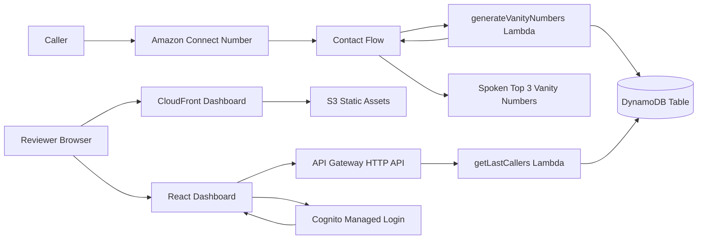
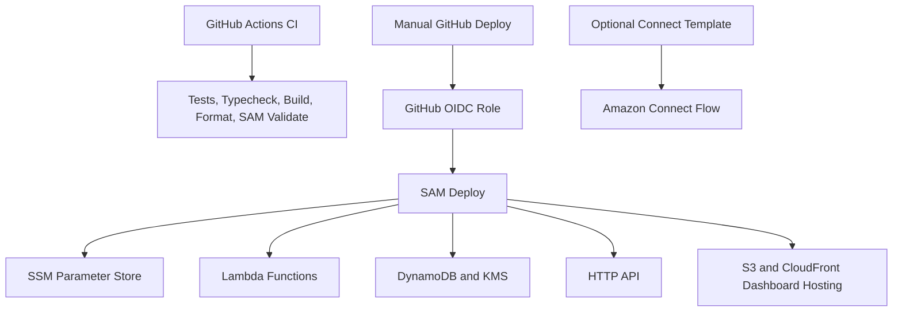

# Architecture

## Runtime View



## Deployment View



## Data Flow

1. Amazon Connect invokes the generation Lambda with the caller endpoint address.
2. The Lambda normalizes the phone number and generates deterministic vanity candidates.
3. The top five candidates are stored in DynamoDB with TTL, a GSI-friendly record type, and a `ContactId`-based idempotency key when available.
4. The top three candidates are returned to Amazon Connect as external string attributes.
5. The dashboard API reads recent records through `LatestCallersIndex` and returns masked caller numbers.
6. The React dashboard is served from CloudFront backed by a private S3 bucket.
7. The React dashboard signs in through Cognito and stores an OIDC access token client-side.
8. The dashboard calls the API endpoint configured through runtime `config.js` with a Bearer token.
9. API Gateway validates the JWT before invoking `getLastCallers`.

## Repository Layout

```txt
backend/   Lambda source, tests, SAM template, backend package lock
frontend/  React/Vite dashboard and frontend package lock
docs/      Reviewer documentation, sample events, optional Connect artifacts
.github/   CI and manual deployment workflows
```
